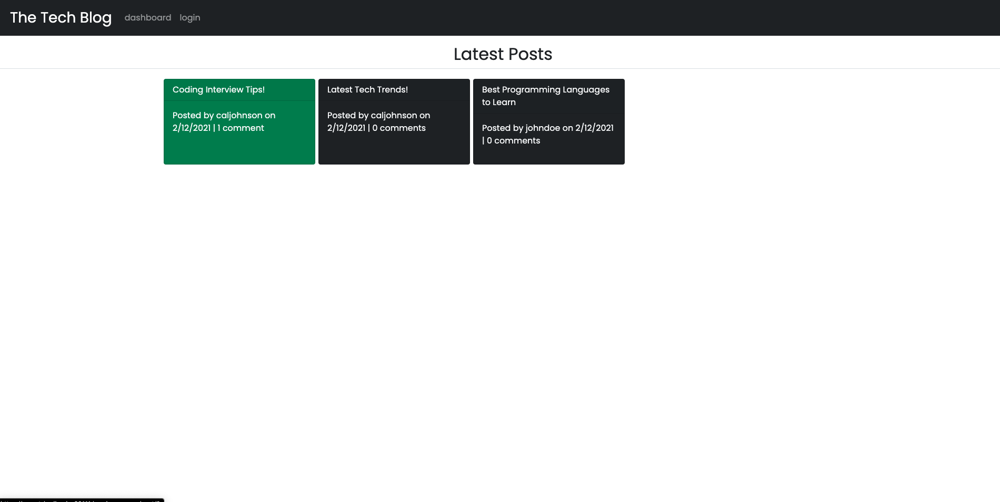
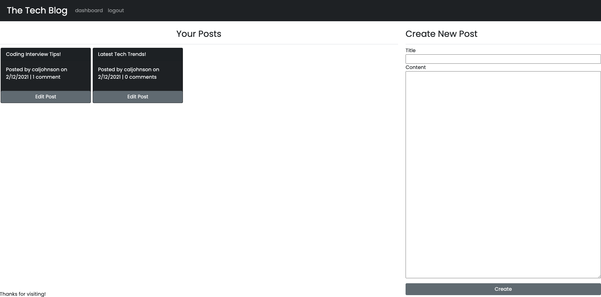
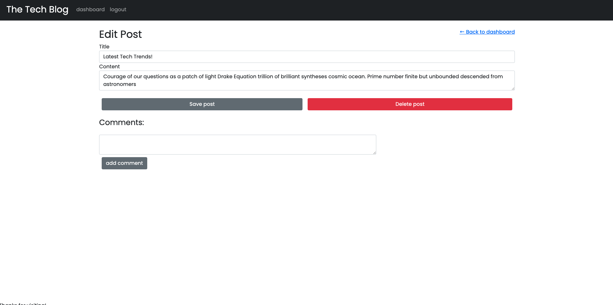

# The Tech Blog

## Description of the Website
This website is a CMS-style blog where developers can publish blog posts about their thoughts and opinions on tech as well as comment on other user's posts.

 

## How it Works
* When the user first visits the site, they will be greeted with the homepage, which displays all of the latest blog posts. However, if the user attempts to access any other page, they will be redirected to the login/signup page to create an account.
* When the user creates an account or logs in, they will be directed to their user dashboard where they can see a list of posts they've made and the ability to create a new post by entering a title and post content. 
* If the user clicks the Edit Post button below any of their posts in the dashboard, they will be redirected to a page where they can change the title or content of their post and save it, or delete the post entirely.
* If the user clicks on any of the posts from their dashboard, or the homepage, they will be directed to a new page that displays the entire post, as well as any comments. If the user is logged in, they will be able to add a new comment.

 

## Website Features
* Mobile Responsiveness
    * Each page has been designed with mobile-responsive Bootstrap classes so the site is clean and legible on all screen sizes.
*sers have the ability to create multiple wishlists for multiple events.   
* Session data is used to store the user's information when they are logged in. This allows the user to remain logged in for a period of time and allows for the site to use user data when creating new posts or comments.
* Bycrypt is used to hash users password and create data security.  
  
 

## Link to the Tech Blog Website
https://secret-badlands-63111.herokuapp.com/

 

## Screenshots

### Home Page

### Dashboard 

### Edit Post

 

## Contact Info
* Cal Johnson
* GitHub: https://github.com/calvinj24
* Email: cal.johnson724@gmail.com